# psr-pl — Network & Resource Diagram (Mermaid)

Generated from [`deploy/cloudformation/psr-pl-localstack.yaml`](../../deploy/cloudformation/psr-pl-localstack.yaml), the CloudFormation stack deployed to MiniStack (`ministackorg/ministack`).

```mermaid
flowchart TB
    subgraph Clients["Clients — outside the CloudFormation stack (plain docker run)"]
        UI1["application-management-ui\n:3000"]
        UI2["pricing-offers-ui\n:3001"]
        UI3["document-management-ui\n:3002"]
        UI4["offer-acceptance-ui\n:3003"]
    end

    subgraph AWSCloud["AWS Cloud"]
      subgraph Region["Region: us-east-1"]

        subgraph APIGW["API Gateway v2 (HTTP API) — one per service"]
            GW1["application-management-api\nANY /{proxy+}"]
            GW2["pricing-orchestration-api\nANY /{proxy+}"]
            GW3["workflow-status-api\nANY /{proxy+}"]
            GW4["offer-acceptance-api\nANY /{proxy+}"]
            GW5["document-api\nANY /{proxy+}"]
        end

        subgraph VPC["VPC · psr-pl-vpc · 10.0.0.0/16"]
            IGW["Internet Gateway"]

            subgraph ECS["ECS Cluster: psr-pl-cluster (FARGATE)"]
                subgraph L1["application-management-service\n10.0.1.0/24 · 10.0.2.0/24\nSG: app-mgmt (in tcp/8081)"]
                    AppMgmt["application-management-service\n:8081 · Service, desired 1"]
                    OfferlogMock["offerlog-mock\n:9090 · sidecar"]
                end
                subgraph L2["pricing-orchestration-service\n10.0.3.0/24 · 10.0.4.0/24\nSG: pricing (in tcp/8082)"]
                    Pricing["pricing-orchestration-service\n:8082 · Service, desired 1"]
                    PricingFargate["pricing-fargate\nRunTask only — no Service"]
                end
                subgraph L3["workflow-status-service\n10.0.5.0/24 · 10.0.6.0/24\nSG: workflow (in tcp/8086)"]
                    Workflow["workflow-status-service\n:8086 · Service, desired 1"]
                end
                subgraph L4["offer-acceptance-service\n10.0.7.0/24 · 10.0.8.0/24\nSG: offer-acceptance (in tcp/8085)"]
                    OfferAccept["offer-acceptance-service\n:8085 · Service, desired 1"]
                end
                subgraph L5["document-service\n10.0.9.0/24 · 10.0.10.0/24\nSG: document (in tcp/8084)"]
                    Document["document-service\n:8084 · Service, desired 1"]
                end
            end
        end

        subgraph SFN["Step Functions: PricingOrchestration (real, unmodified ASL)"]
            direction TB
            S1["SoftPullRequest"]
            S2["PricingCalculation"]
            S3["AwaitOfferSelection"]
            S4{"ConsentGivenCheck"}
            S5["HardPullRequest"]
            S6["DecisionRouting"]
            S7["ConsentDeclined"]
            S8["UpdateApplicationStatus"]
            S1 --> S2 --> S3 --> S4
            S4 -->|consentGiven = true| S5 --> S6 --> S8
            S4 -->|consentGiven = false| S7 --> S8
        end

        subgraph Lambdas["Lambda functions — provided.al2023 / arm64"]
            FnSoft["soft-pull-lambda"]
            FnHard["hard-pull-lambda"]
            FnDecision["decision-lambda"]
            FnPresent["present-offer-lambda"]
            FnUpdate["update-status-lambda"]
        end

        subgraph DDB["DynamoDB — PAY_PER_REQUEST"]
            T1[("pl-application\nHASH id · TTL: ttl")]
            T2[("pl-pricing-offer\nHASH applicationId")]
            T3[("pl-offer-acceptance\nHASH applicationId")]
            T4[("pl-document\nHASH applicationId")]
        end

        IAM["IAM Roles ×7\nLambdaExecutionRole, EcsTaskExecutionRole,\n5× per-service TaskRole, PricingFargateTaskRole,\nStepFunctionsExecutionRole"]
        CW["CloudWatch Logs ×7 groups\n/ecs/* per task family + /psr-pl/lambda"]

      end
    end

    %% clients -> their own gateway
    UI1 --> GW1
    UI2 --> GW2
    UI3 --> GW3
    UI3 --> GW5
    UI4 --> GW4

    %% API Gateway -> service (actual path: host.docker.internal, bypasses VPC)
    GW1 -. "host.docker.internal:8081" .-> AppMgmt
    GW2 -. "host.docker.internal:8082" .-> Pricing
    GW3 -. "host.docker.internal:8086" .-> Workflow
    GW4 -. "host.docker.internal:8085" .-> OfferAccept
    GW5 -. "host.docker.internal:8084" .-> Document

    %% services -> their own table
    AppMgmt --> T1
    Pricing --> T2
    OfferAccept --> T3
    Document --> T4

    %% workflow kickoff
    AppMgmt -->|"states:StartExecution"| S1

    %% state machine -> compute
    S1 --> FnSoft
    S2 -->|"ecs:runTask.waitForTaskToken"| PricingFargate
    S3 -->|"lambda:invoke.waitForTaskToken"| FnPresent
    S5 --> FnHard
    S6 --> FnDecision
    S8 --> FnUpdate

    %% lambdas calling back out (also host.docker.internal, not Cloud Map)
    FnPresent -. "host.docker.internal:8082" .-> Pricing
    FnUpdate -. "host.docker.internal:8081" .-> AppMgmt

    classDef client fill:#64748b,color:#fff,stroke:#475569,stroke-width:1px;
    classDef compute fill:#ED7100,color:#fff,stroke:#b95600,stroke-width:1px;
    classDef database fill:#3B48CC,color:#fff,stroke:#28329c,stroke-width:1px;
    classDef networking fill:#8C4FFF,color:#fff,stroke:#6a35cc,stroke-width:1px;
    classDef security fill:#DD344C,color:#fff,stroke:#a82238,stroke-width:1px;
    classDef integration fill:#E7157B,color:#fff,stroke:#b30f60,stroke-width:1px;

    class UI1,UI2,UI3,UI4 client
    class AppMgmt,OfferlogMock,Pricing,PricingFargate,Workflow,OfferAccept,Document,FnSoft,FnHard,FnDecision,FnPresent,FnUpdate compute
    class T1,T2,T3,T4 database
    class IGW networking
    class IAM security
    class GW1,GW2,GW3,GW4,GW5,S1,S2,S3,S4,S5,S6,S7,S8,CW integration

    style VPC fill:#f2ebff20,stroke:#8C4FFF,stroke-width:2px
    style ECS fill:#fdf1e620,stroke:#ED7100,stroke-width:1.5px,stroke-dasharray: 4 3
    style AWSCloud fill:transparent,stroke:#8a92a3,stroke-width:2px,stroke-dasharray: 6 4
    style Region fill:transparent,stroke:#aab1bf,stroke-width:1.5px
```

> **Note on the dashed edges:** the VPC/subnets/security groups shown below are real CloudFormation resources, but they are not the actual traffic path. Every API Gateway → service, Lambda → service, and service → service call goes over `host.docker.internal:<port>` (dashed lines), not through VPC routing — MiniStack's VpcLink API 404s and its Cloud Map DNS records don't resolve inside real containers, both confirmed empirically. Solid lines are the genuine, functioning connections (ECS launching containers, Step Functions invoking Lambda/ECS, services reading their own DynamoDB table).

## Legend

| Color | AWS category | Resources in this diagram |
|---|---|---|
| 🟧 Orange | Compute / Containers | Lambda, ECS, Fargate |
| 🟦 Blue | Database | DynamoDB |
| 🟪 Purple | Networking & Content Delivery | VPC, Internet Gateway |
| 🟥 Red | Security, Identity & Compliance | IAM Roles |
| 🟩 Pink | App Integration / Management & Governance | API Gateway, Step Functions, CloudWatch Logs |
| ⬛ Slate | Client | The four UIs (not part of this CloudFormation stack) |

Dashed arrows = the real, live traffic path (`host.docker.internal:<port>`). Solid arrows = genuine AWS-native invocation (ECS launching containers, Step Functions calling Lambda/ECS, a service reading its own table).
